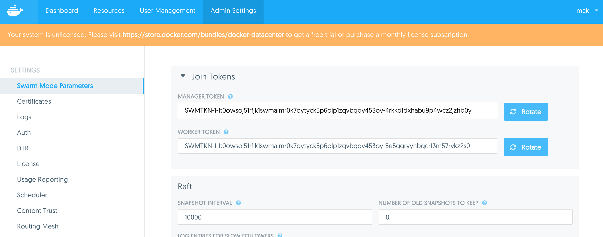
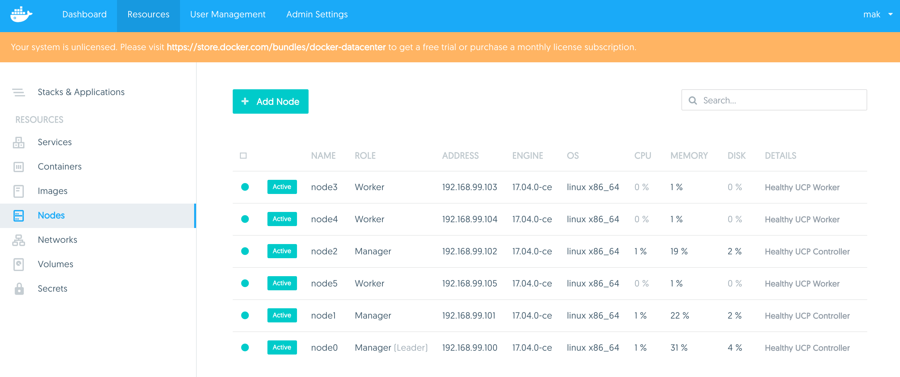
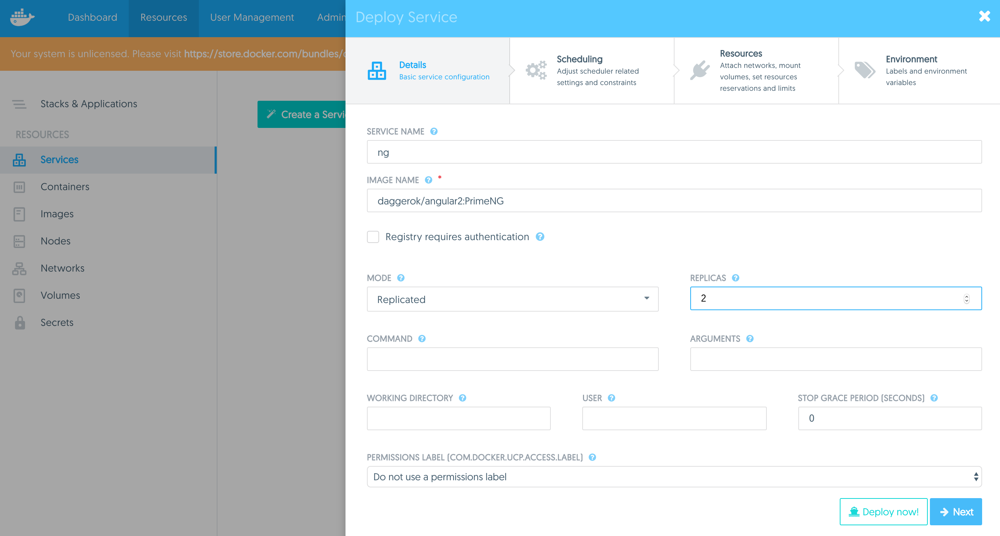
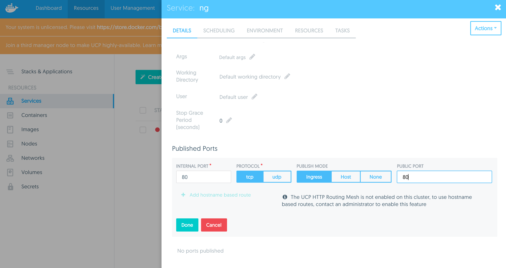
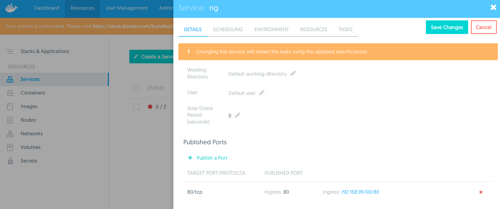
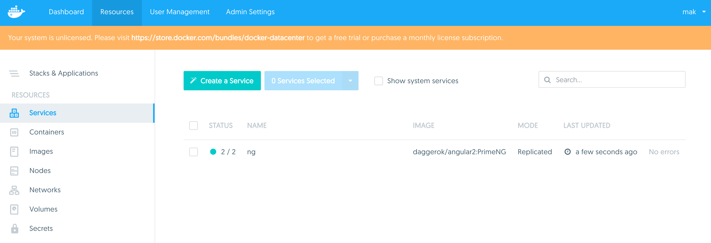
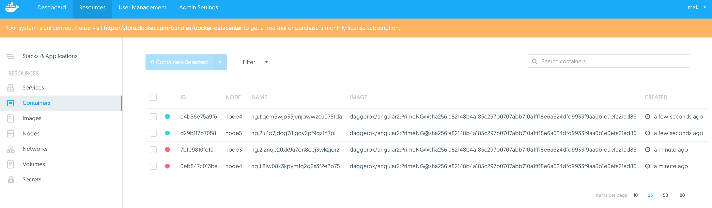
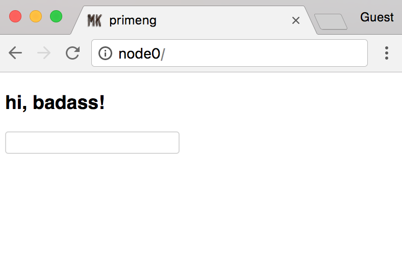

# docker-ucp

docker ucp (universal control plane) installation using docker-machine (OSX)

## pre

```bash
vim /etc/hosts
...
# docker
192.168.99.100 node0
192.168.99.101 node1
192.168.99.102 node2
192.168.99.103 node3
192.168.99.104 node4
192.168.99.105 node5
...
:wq!
```

## installation

create docker machines:
- fish
```fish
for i in 0 1 2 3 4 5; docker-machine create "node$i"; end;
```
- bash
```bash
for i in 0 1 2 3 4 5; do docker-machine create "node$i"; done;
```

install UCP

```bash
docker-machine ssh node0
# we need inet addr
ifconfig eth1 | grep 'inet ' | awk '{print $2}' | awk -F ':' '{print $2}' # 192.168.99.100
docker run --rm -it -v /var/run/docker.sock:/var/run/docker.sock --name ucp docker/ucp install -i --swarm-port 3376 --host-address 192.168.99.100
...
# enter admin username, password, confirm password, for example: mak, password12345678, password12345678
...
# no need aliases (empty), just press enter
...
INFO[0038] Login to UCP at https://node0
INFO[0038] Username: mak
INFO[0038] Password: (your admin password)
```

[open https://node0](https://node0)

Your system is unlicensed: skip for now

go to [https://node0/#/settings/swarm](https://node0/#/settings/swarm)


copy manager token. im my case it's
`SWMTKN-1-1t0owsoj51rfjk1swmaimr0k7oytyck5p6olp1zqvbqqv453oy-4rkkdfdxhabu9p4wcz2jzhb0y`

join manager nodes

```bash
docker-machine ssh node1 # do same for node2 to make UCP highly-avilibility
## old way will not work:
#ifconfig eth1 | grep 'inet ' | awk '{print $2}' | awk -F ':' '{print $2}' # 192.168.99.102
#docker run --rm -it -v /var/run/docker.sock:/var/run/docker.sock --name ucp docker/ucp join -i --host-address 192.168.99.101
## use new docker swarm join syntax:
docker swarm join --token SWMTKN-1-1t0owsoj51rfjk1swmaimr0k7oytyck5p6olp1zqvbqqv453oy-4rkkdfdxhabu9p4wcz2jzhb0y 192.168.99.100
```

join workers

go to [https://node0/#/settings/swarm](https://node0/#/settings/swarm)

copy worker token. im my case it's
`SWMTKN-1-1t0owsoj51rfjk1swmaimr0k7oytyck5p6olp1zqvbqqv453oy-5e5ggryyhbqcr13m57rvkz2s0`

```bash
docker-machine ssh node3 # do same for other worker nodes: node4 and node5
docker swarm join --token SWMTKN-1-1t0owsoj51rfjk1swmaimr0k7oytyck5p6olp1zqvbqqv453oy-5e5ggryyhbqcr13m57rvkz2s0 192.168.99.100
```

[go to https://node0/#/resources/nodes](https://node0/#/resources/nodes) and verify your cluster


## lets deploy something

[go to https://node0/#/resources/services](https://node0/#/resources/services/wizard):

create service from daggerok/angular2:PrimeNG image with 2 replicas


scroll down to update details


and publish port


save details


verify services tab


verify containers tab


check application (service) is running:

go to [http://node0/](http://node0/) or [http://node1/](http://node1/) or any other cluster node (because of docker swarm cluster reverce proxy...)

